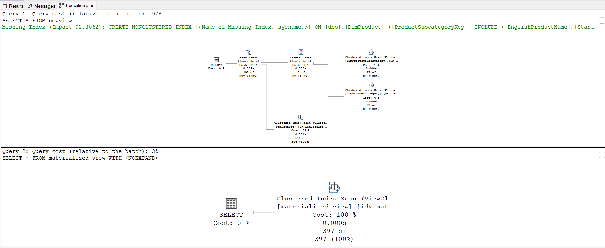

# SQL
#### SQL-toolkit
This SQL script creates two views: a standard view (newview) and a materialized view (materialized_view). The purpose of these views is to provide structured access to product-related information by joining tables containing product details, subcategories, and categories.

1. Standard View (newview)

The newview is a virtual table that does not store data physically but retrieves it dynamically upon querying. It joins three tables:

DimProduct (containing product details)

DimProductSubcategory (containing product subcategory details)

DimProductCategory (containing product category details)

The query extracts fields such as ProductKey, EnglishProductName, StandardCost, Color, ListPrice, Size, ProductLine, EnglishProductCategoryName, and EnglishProductSubcategoryName.

2. Materialized View (materialized_view)

The materialized_view stores data physically, improving query performance. It uses WITH SCHEMABINDING to ensure table integrity and prevent schema modifications that would invalidate the view. Additionally, a unique clustered index (idx_materialized_view) is created on ProductKey to optimize retrieval speed.

3. Query Execution Plan

To analyze query execution plans, SET SHOWPLAN_ALL ON is enabled before selecting from both views. SHOWPLAN_ALL provides execution details without running the queries. The WITH (NOEXPAND) hint is used while querying materialized_view, ensuring that the optimizer uses the indexed view instead of expanding the underlying query.

#### Summary

This script demonstrates how to create and optimize views for efficient data retrieval. The standard view provides flexibility without storage overhead, while the materialized view enhances performance by precomputing results and indexing them.
